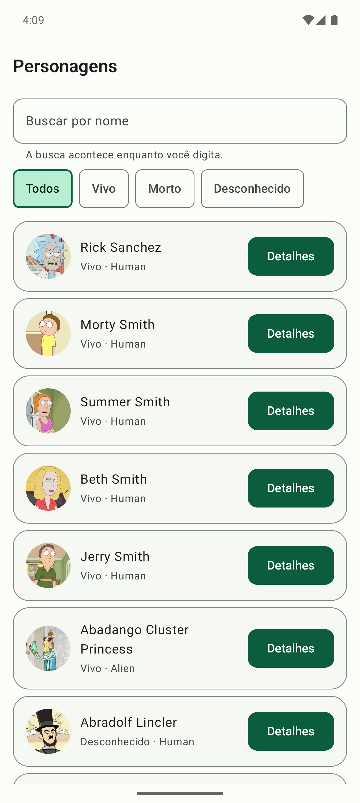
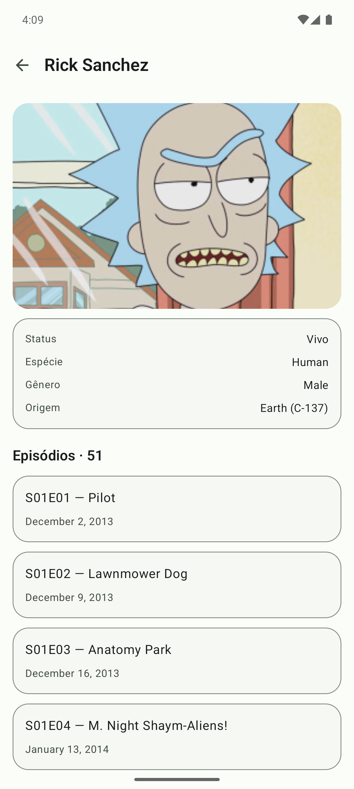
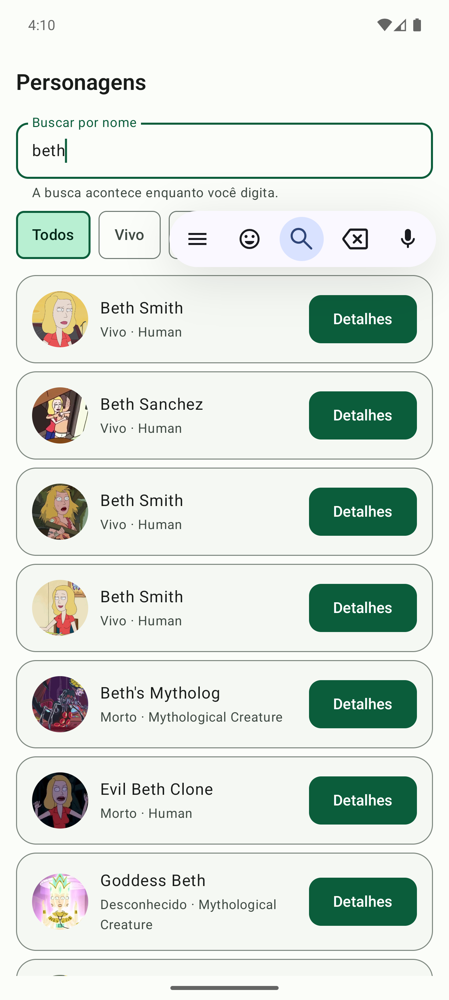

# Rick & Morty

Navegador de personagens da série, consumindo a API pública **GraphQL** de [rickandmortyapi.com](https://rickandmortyapi.com/graphql). Lista paginada com busca e filtro de status, e tela de detalhe com os episódios do personagem.

Kotlin, Compose, **MVI**, **Koin** e **Apollo GraphQL**, com o core compartilhado vindo de um repositório separado.

| Lista | Detalhe | Busca |
|---|---|---|
|  |  |  |

---

## Arquitetura

```
:app                  Application, NavHost, inicialização do Koin
:domain               modelos, contratos, use cases          (Kotlin puro)
:data                 Apollo, mappers, repositório
:feature:characters   MVI (lista e detalhe) + Compose
```

O core não vive aqui. Vem publicado do repositório [**rickmorty-core**](https://github.com/MarcosEduardoJr/rickmorty-core):

```
com.github.MarcosEduardoJr.rickmorty-core:core-common
com.github.MarcosEduardoJr.rickmorty-core:core-mvi
com.github.MarcosEduardoJr.rickmorty-core:core-network
com.github.MarcosEduardoJr.rickmorty-core:core-designsystem
```

É a divisão usada quando design system e infraestrutura servem mais de um app: versionados, publicados e consumidos por coordenada, em vez de copiados ou incluídos como submódulo. O `settings.gradle.kts` resolve `mavenLocal()` antes do JitPack, o que permite iterar no core sem publicar tag.

## MVI

O fluxo é sempre **intent → efeito colateral → result → reducer → estado**. A UI só despacha intents e lê estado; nada decide regra na camada de Compose.

```
CharactersIntent ──→ CharactersViewModel ──→ LoadCharactersUseCase ──→ CharacterRepository
                            │                                                │
                            │←──────────── CharactersResult ←─────────────────┘
                            ↓
                   CharactersReducer (função pura)
                            ↓
                     CharactersState ──→ Compose
                            │
                     CharactersEffect ──→ navegação / snackbar
```

**Por que existe `CharactersResult` separado do intent.** O intent descreve o que o usuário fez; o result descreve o que aconteceu. Com essa separação, [`CharactersReducer`](feature/characters/src/main/java/com/mej/rickmorty/feature/characters/list/CharactersReducer.kt) é uma função pura que concentra toda a regra de paginação — quando acumular página, quando substituir a lista, quando parar de pedir mais — e é testada sem coroutines, sem mock e sem Android.

**Estado vs efeito.** Erro ao carregar a primeira página entra no *estado* (a tela mostra retry). Erro ao paginar vira *efeito* (snackbar), porque a lista já exibida não pode ser apagada por uma falha de scroll.

**Paginação.** Rolar até o fim vira `LoadMore`; a UI não sabe se existe próxima página. `canLoadMore` é derivado do estado e bloqueia disparos concorrentes.

**Busca com debounce.** O texto entra no estado imediatamente para o campo não travar, mas a query só sai após 350 ms de silêncio — sem isso seria uma requisição por tecla.

## GraphQL

O schema fica versionado em [`schema.graphqls`](data/src/main/graphql/com/mej/rickmorty/graphql/schema.graphqls), com o subconjunto de tipos que as operações usam. Build reprodutível e offline; `./gradlew downloadApolloSchema` atualiza o arquivo.

Duas operações, cada uma pedindo exatamente o que a tela mostra:

- [`CharactersPage.graphql`](data/src/main/graphql/com/mej/rickmorty/graphql/CharactersPage.graphql) — id, nome, status, espécie e imagem. A lista não paga pelo payload do detalhe.
- [`CharacterDetail.graphql`](data/src/main/graphql/com/mej/rickmorty/graphql/CharacterDetail.graphql) — personagem **e** episódios numa única ida ao servidor. Em REST seriam 1 + N chamadas.

**Erro em GraphQL não é status HTTP.** A API responde 200 com a lista `errors` no corpo, então a verificação é sobre `response.errors` e `response.data`, não sobre o código HTTP. A tradução para `AppError` vive em `core-network`, e nem o domínio nem a UI conhecem Apollo.

**Cache normalizado** guarda cada objeto por id, e não a resposta inteira: o detalhe reaproveita o registro que a lista já trouxe.

**Nulos.** Todo campo do schema é opcional. O mapper é o único ponto que lida com isso — o domínio recebe tipos completos e a UI nunca escreve `?:`.

## Koin

DI declarada em código e resolvida em runtime, em [`dataModule`](data/src/main/java/com/mej/rickmorty/data/di/DataModule.kt) e [`charactersModule`](feature/characters/src/main/java/com/mej/rickmorty/feature/characters/CharactersModule.kt).

A contrapartida de não ter container gerado é não ter verificação do grafo pelo compilador: um binding faltando só apareceria quando a tela abrisse. Por isso [`KoinModulesTest`](app/src/test/java/com/mej/rickmorty/KoinModulesTest.kt) sobe o container com os módulos reais e resolve cada ponto de entrada, incluindo o ViewModel que recebe o id do personagem como parâmetro de runtime — o build quebra antes.

## Rodar

Requer JDK 17 e o Android SDK (compileSdk 35). O core vem do JitPack, sem passo extra.

```bash
./gradlew :app:installDebug
```

```bash
./gradlew test detektAll coverageAll
```

```bash
./gradlew :feature:characters:connectedDebugAndroidTest
```

Para trabalhar no core junto com o app, publique local — `mavenLocal()` tem precedência sobre o JitPack:

```bash
git clone https://github.com/MarcosEduardoJr/rickmorty-core && (cd rickmorty-core && ./gradlew publishAllToMavenLocal)
```

## Testes

| Suíte | Onde | Quantidade |
|---|---|---|
| Reducer (função pura) | `:feature:characters` | 6 |
| ViewModel MVI | `:feature:characters` | 5 |
| Conversão de status | `:domain` | 2 |
| Grafo do Koin | `:app` | 2 |
| Acessibilidade (instrumentado) | `:feature:characters` | 5 |

O repositório é substituído por um fake com estado real — o teste valida resultado, não chamada de método.

[`AccessibilityTest`](feature/characters/src/androidTest/java/com/mej/rickmorty/feature/characters/AccessibilityTest.kt) roda sobre a árvore semântica mesclada — a mesma que o TalkBack consome — e valida nome acessível em todo elemento acionável, alvo de toque ≥ 48dp medindo `touchBoundsInRoot`, título marcado como cabeçalho, carregamento em live region e estado de erro anunciado com caminho de recuperação.

## Build

| Tipo | R8 | applicationId |
|---|---|---|
| `debug` | não | `com.mej.rickmorty.debug` |
| `staging` | sim | `com.mej.rickmorty.staging` |
| `release` | sim + `shrinkResources` | `com.mej.rickmorty` |

Convention plugins em `build-logic/` padronizam os módulos; detekt roda com `maxIssues: 0`.

## Comparação com o projeto irmão

[foco-android](https://github.com/MarcosEduardoJr/foco-android) resolve um problema diferente com o conjunto oposto de escolhas — mesma barra de qualidade, para a comparação ser sobre arquitetura e não sobre maturidade de setup:

| | foco-android | este projeto |
|---|---|---|
| Apresentação | MVVM (métodos públicos, estado único) | MVI (intent, result, reducer puro, effect) |
| Injeção | Hilt (grafo em tempo de compilação) | Koin (runtime + teste que verifica o grafo) |
| Dados | Room e DataStore, offline-first | Apollo GraphQL, rede |
| Core | módulos no mesmo repositório | biblioteca publicada em repositório separado |

## Stack

AGP 8.7.3 · Kotlin 2.0.21 · Compose BOM 2024.11 · Apollo 4.1.0 · Koin 4.0.0 · Coil 2.7.0 · Navigation Compose · detekt 1.23.7 · compileSdk 35 · minSdk 24 · JDK 17

## Limitações conhecidas

- Sem cache em disco: o cache normalizado do Apollo é em memória, então o app depende de rede a cada abertura. `apollo-normalized-cache-sqlite` cobriria offline.
- A acessibilidade é verificada por teste automatizado, mas não houve navegação manual com TalkBack ligado — único jeito de conferir ordem de leitura e verbosidade dos anúncios.
- A paginação recarrega desde a primeira página quando o filtro muda; um cache por combinação de filtro evitaria a ida à rede ao alternar chips repetidamente.
